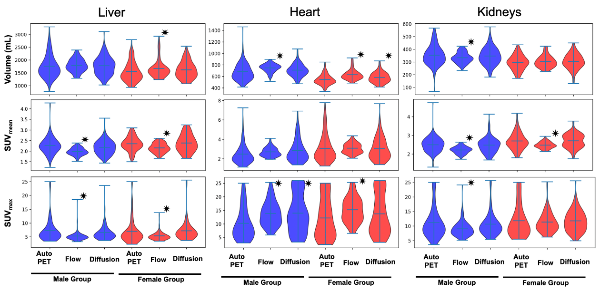

# Cascaded 3D Diffusion Models for Whole-body ¹⁸F-FDG PET/CT Synthesis

## Abstract
This repository implements a cascaded volumetric image synthesis pipeline that combines conditional diffusion and flow-based super-resolution modules to generate realistic whole-body ¹⁸F-FDG PET/CT scans from demographic variables (height, weight, sex, age). The approach proceeds from low-resolution diffusion-based generation to high-resolution refinement, enabling anatomy-preserving, demographically conditioned volumes. Comprehensive preprocessing, training, inference, and evaluation scripts facilitate reproduction and extension.

## Features
- Demographic conditioning on height, weight, sex, and age  
- Two-stage generation: low-resolution diffusion → super-resolution flow  
- Modular scripts for data handling, training, inference, and evaluation  
- Quantitative metrics: Dice, Hausdorff, intensity statistics  

## Repository Structure
```
0_Preprocess/       Data conversion, segmentation, and intensity scaling
1_Trainings/        Training scripts and configs for diffusion & flow modules
2_Tests/            Inference utilities and shared runtime libraries
3_Evaluations/      Evaluation metrics and statistical analysis
Resource/           Pipeline diagrams and result figures
```

## Requirements
- Python 3.8 or later  
- PyTorch 2.0+ with CUDA support  
- NumPy, SciPy, scikit-learn, scikit-image  
- imageio, imageio-ffmpeg, pyspng, pillow, nibabel, click, requests, tqdm, psutil  
- See `requirements.txt` for exact versions  

## Installation
```bash
git clone https://github.com/yourusername/TotalGen.git
cd TotalGen
python -m venv venv
source venv/bin/activate
pip install --upgrade pip
pip install -r requirements.txt
```

## Quick Start
1. **Preprocess data**  
   ```bash
   cd 0_Preprocess
   bash run_preprocessing.sh \
     --input_dir /path/to/raw_data \
     --output_dir /path/to/processed
   ```
2. **Train low-resolution diffusion**  
   ```bash
   cd ../1_Trainings
   python train_diffusion.py --config config_lowres.yaml
   ```
3. **Train super-resolution flow**  
   ```bash
   python train_superres.py --config config_superres.yaml
   ```
4. **Run inference**  
   ```bash
   cd ../2_Tests
   python infer.py \
     --model_dir /path/to/checkpoints \
     --demo_csv demographics.csv \
     --output_dir results/
   ```
5. **Evaluate results**  
   ```bash
   cd ../3_Evaluations
   python evaluate.py \
     --pred_dir results/ \
     --gt_dir ground_truth/ \
     --metrics dice hausdorff
   ```

## Figures
  
*Figure 1. Overview of the cascaded diffusion and flow modules.*

  
*Figure 2. Dataset and generated cohort BMI distributions.*

  
*Figure 3. Performance comparison across model variants.*

## Citation
```bibtex
@article{yoon2025cascaded,
  title   = {Cascaded 3D Diffusion Models for Whole-body {¹⁸F}-FDG PET/CT Synthesis from Demographics},
  author  = {Yoon, Siyeop and …},
  journal = {arXiv preprint arXiv:2505.22489},
  year    = {2025}
}
```

## Contact
- yooneige@gmail.com  
- syoon5@mgh.harvard.edu  

## License
See the [LICENSE](LICENSE) file for details.
